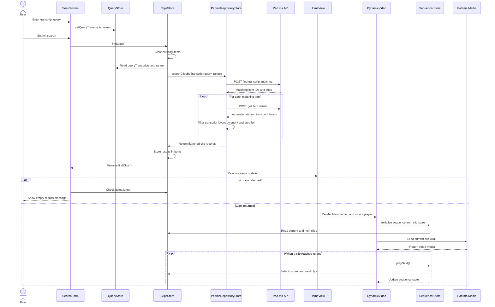

# Application Architecture

**Project:** `frontend/` (Vue frontend)  
**Purpose:** Shows how transcript search results move through the frontend and into clip playback.

## Transcript Search and Playback

## Current Boundaries

- The frontend calls the Pad.ma API directly. The local Express server is a separate API path.
- The search store passes `range`, but the Padma repository store currently sends a fixed API range of `[0, 100]`.
- `SideSection` can display the clip playlist, but its use in `HomeView` is currently commented out.
